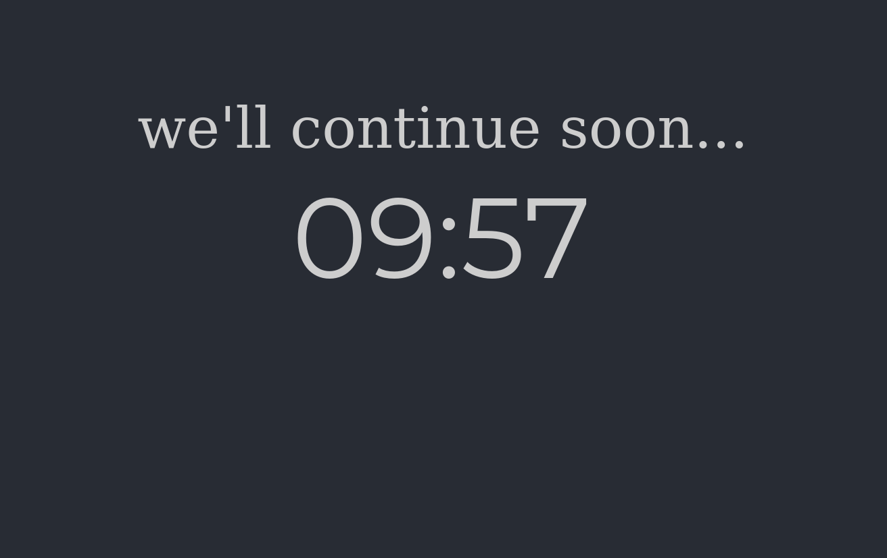
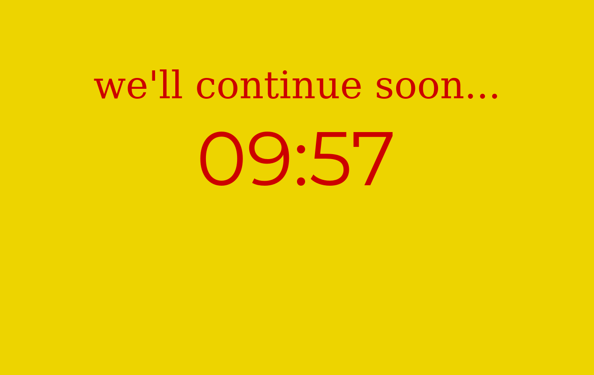
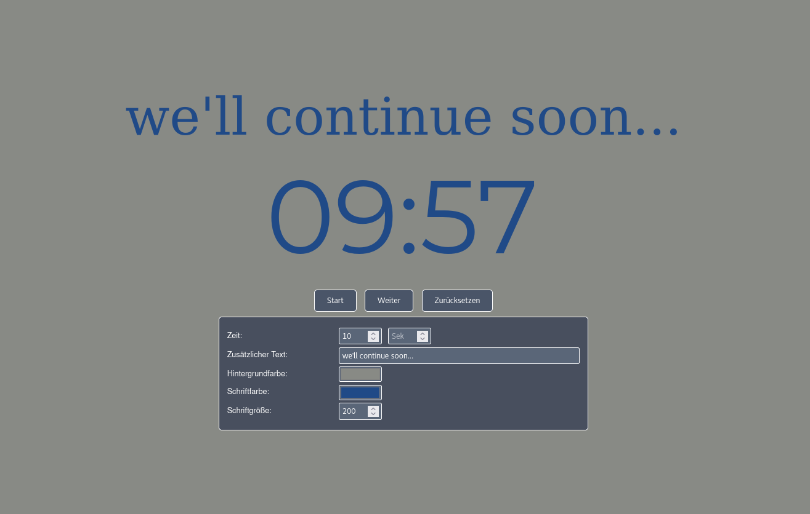
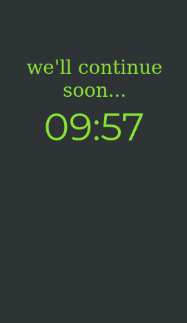
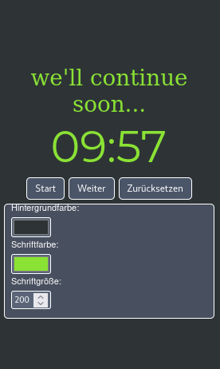

# WebTimer
A minimalist, responsive countdown timer for the browser with extensive customization options.

  
  

## Features

### Timer Controls
- **Countdown Timer**: Set minutes and seconds and start the timer
- **Start/Pause Function**: Start and pause the timer at will
- **Reset**: Reset the timer to its initial state
- **Automatic Fade-Out Animation**: At the end of the countdown, the screen elegantly fades to black

### Customization Options
- **Time Settings**: Configure minutes (Min) and seconds (Sec) separately
- **Additional Text**: Add a custom message displayed above the timer (e.g., "be right back...")
- **Background Color**: Choose any background color using the color picker
- **Text Color**: Customize the text color to your preference
- **Font Size**: Adjust the size of the timer display individually

  

### User Interface
- **Responsive Design**: Optimized for all screen sizes - from smartphone to desktop
- **Fullscreen Mode**: Ideal for presentations and lectures
- **Auto-Hide Controls**: Controls automatically hide when the timer is running and reappear on mouse movement
- **Real-Time Updates**: All changes in the settings are displayed instantly in the preview

  
  

## Usage

1. Open the `web-timer.html` file in a modern web browser
2. Enter the desired time in minutes and seconds
3. Optionally adjust the text, colors, and font size
4. Click "Start" to begin the countdown
5. Use "Pause" to halt and "Reset" to restart

### Tips
- Move your mouse over the lower area to display the controls during a running timer
- Use your browser's fullscreen mode (F11) for an even better presentation
- All settings are updated in real-time, allowing you to find your perfect configuration

## Technical Details

- Pure HTML/CSS/JavaScript solution without external dependencies
- No installation required
- Works offline
- Compatible with all modern browsers (Chrome, Firefox, Safari, Edge)

## License

This project is licensed under the **GNU General Public License v3.0**.

This means:
- You can freely use, copy, and distribute the software
- You can modify the software and distribute your changes
- If you distribute modified versions, they must also be licensed under GPL v3.0
- The software is provided without warranty

For more details, see the [LICENSE](LICENSE) file or visit https://www.gnu.org/licenses/gpl-3.0.html

## Screenshot Overview

  
  

  <em>The timer in action with custom text and color variations</em>

  

  <em>Start, Pause, and Reset buttons with all customization options</em>

  
  

  <em>Timer optimized for mobile devices and presentations</em>

## Contributions

Suggestions for improvement and contributions are welcome! Since this project is licensed under GPL v3.0, all contributions must also be published under this license.

---

**WebTimer** - Your simple, elegant countdown timer for the browser.
