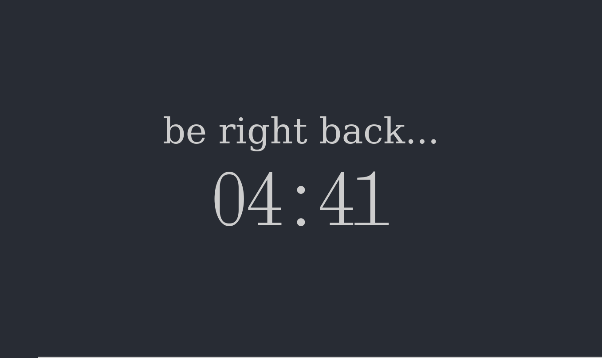
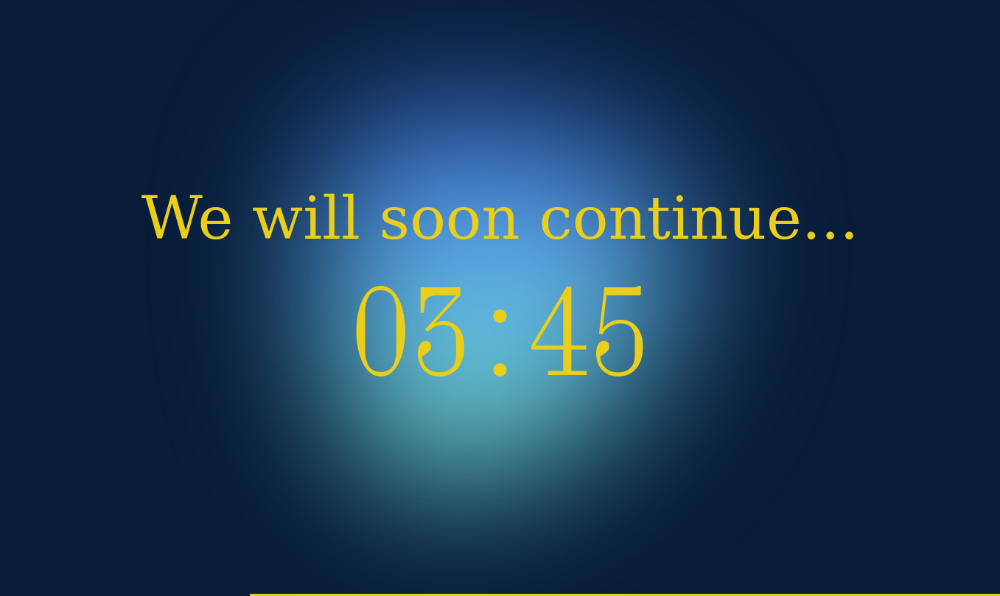
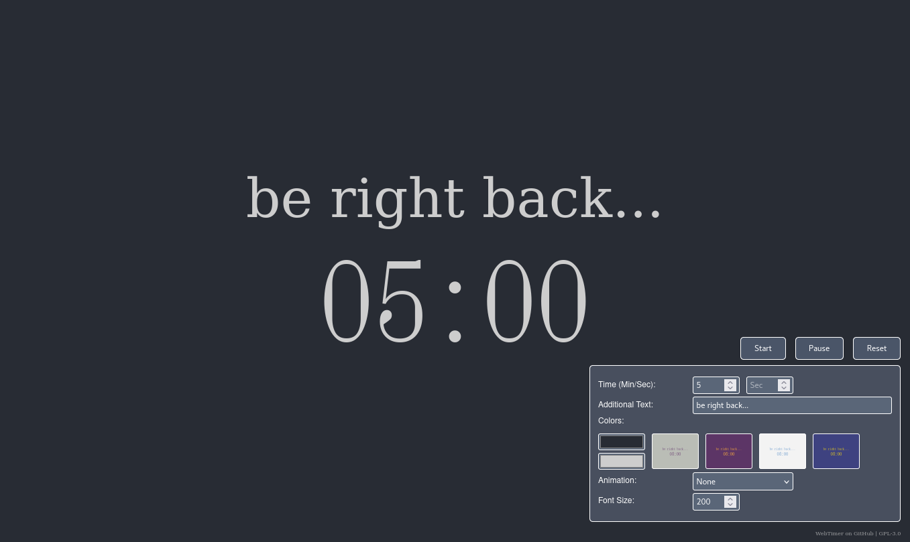
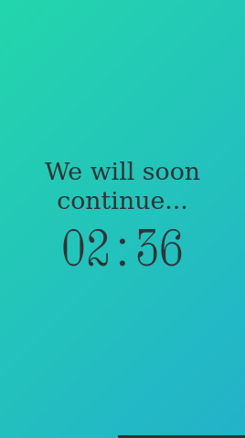
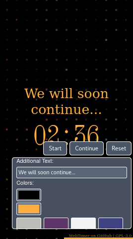

# WebTimer
A minimalist, responsive countdown timer for the browser with extensive customization options, theme presets, and stunning background animations.

  
  

## Features

### Timer Controls
- **Countdown Timer**: Set minutes and seconds and start the timer
- **Start/Pause Function**: Start and pause the timer at will
- **Reset**: Reset the timer to its initial state
- **Automatic Fade-Out Animation**: At the end of the countdown, the screen (including background animations) elegantly fades to black
- **Progress Bar**: Visual indicator at the bottom showing remaining time

### Customization Options
- **Time Settings**: Configure minutes (Min) and seconds (Sec) separately with mouse wheel support
- **Additional Text**: Add a custom message displayed above the timer (e.g., "be right back...")
- **Color Customization**:
  - Background and text colors via color pickers
  - 4 pre-defined theme buttons with instant preview
  - Live preview showing your text and selected time
- **Background Animations**: Optional choose from 3 stunning animations
  - Flicker Gradient (dynamic dotted gradient)
  - Gradient Wave (smooth color transitions)
  - Blob Gradient (animated organic shapes)
- **Font Size**: Adjust the size of the timer display individually
- **Settings Persistence**: All settings are automatically saved in your browser and will be applied on the next page visit
- **Real-Time Preview**: All changes are displayed instantly

  

### User Interface
- **Responsive Design**: Optimized for all screen sizes - from smartphone to desktop
- **Fullscreen Mode**: Ideal for breaks at meetings, presentations and lectures
- **Auto-Hide Controls**: Controls automatically hide when the timer is running and reappear on mouse movement
- **Bottom-Right Positioning**: Compact controls in the lower right corner for unobstructed view
- **Multilingual**: Automatically detects browser language (German/English)

  
  

## Usage

1. Open the `web-timer.html` file in a modern web browser
2. Enter the desired time in minutes and seconds
   - Use mouse wheel while hovering over inputs for quick adjustments
3. Optionally customize:
   - Adjust the text displayed above the timer
   - Choose colors manually or click a theme preview button
   - Select a background animation from the dropdown (Flicker, Gradient Wave, or Blob)
   - Modify the font size
4. Click "Start" to begin the countdown
5. Use "Pause" to halt and "Reset" to restart

### Tips
- Move your mouse over the lower right corner to display the controls during a running timer
- Use your browser's fullscreen mode (F11) for an even better presentation experience
- All settings (time, colors, animation, text, font size) are saved automatically and restored on your next visit
- Try the theme preview buttons for quick color scheme changes - they update instantly with your current text and time
- Background animations add visual interest without distracting from the timer
- The progress bar at the bottom shows the remaining time visually
- The interface automatically adapts to your browser language (German or English)

## Technical Details

- Pure HTML/CSS/JavaScript solution without external dependencies
- CSS animations for background effects (Flicker, Gradient Wave, Blob)
- LocalStorage API for persistent settings across sessions
- Automatic browser language detection (navigator.language)
- Google Fonts integration (Xanh Mono for monospace display)
- Mouse wheel support for numeric inputs
- Responsive design with clamp() for fluid scaling across all devices
- Visual progress bar with smooth transitions
- No installation required
- Works offline (except Google Fonts on first load)
- Compatible with all modern browsers (Chrome, Firefox, Safari, Edge)
- Smooth animations with CSS transitions and keyframes
- Efficient rendering with minimal CPU usage

## License

This project is licensed under the **GNU General Public License v3.0**.

This means:
- You can freely use, copy, and distribute the software
- You can modify the software and distribute your changes
- If you distribute modified versions, they must also be licensed under GPL v3.0
- The software is provided without warranty

For more details, see the [LICENSE](LICENSE) file or visit https://www.gnu.org/licenses/gpl-3.0.html

## Screenshot Overview

  
  

  <em>The digital timer in action with custom text and color variations</em>

  

  <em>Start, Pause, and Reset buttons with theme previews and all customization options in the lower right corner</em>

  
  

  <em>Timer optimized for mobile devices and presentations</em>

## Contributions

Suggestions for improvement and contributions are welcome! Since this project is licensed under GPL v3.0, all contributions must also be published under this license.

---

**WebTimer** - Your simple, elegant countdown timer with stunning animations for the browser.
